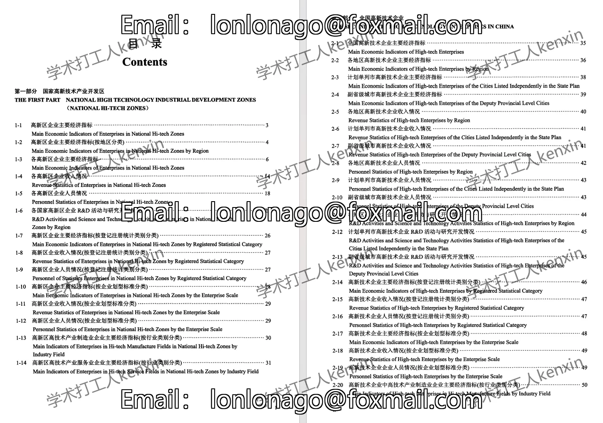
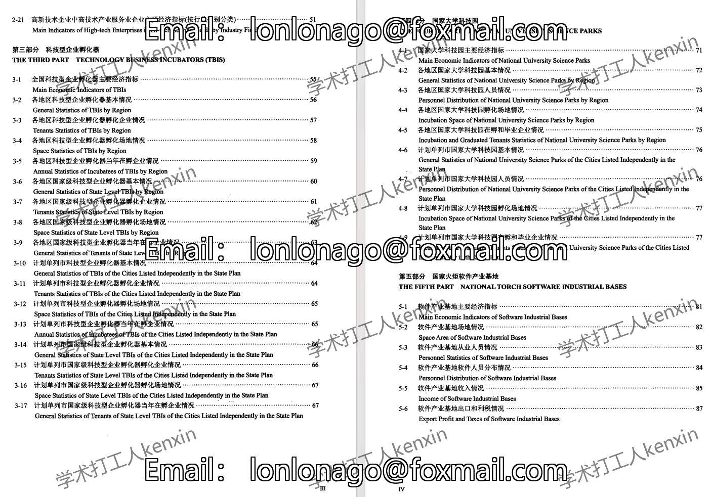
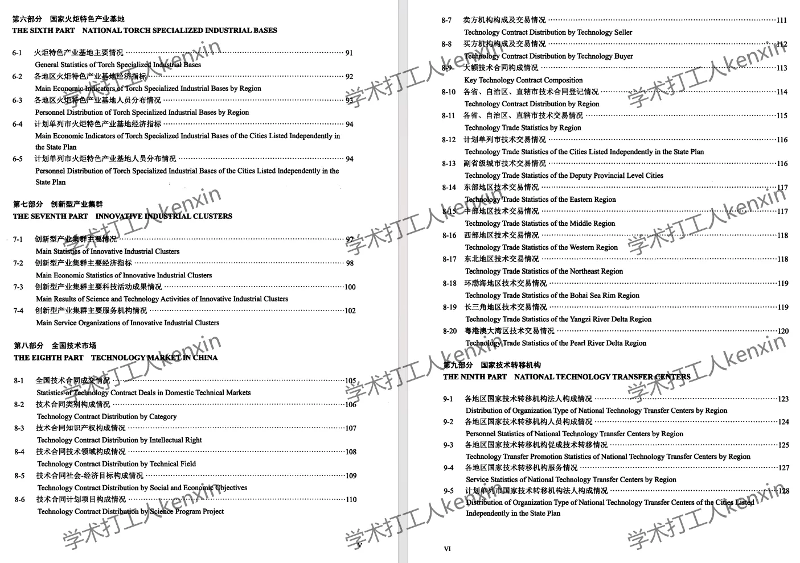
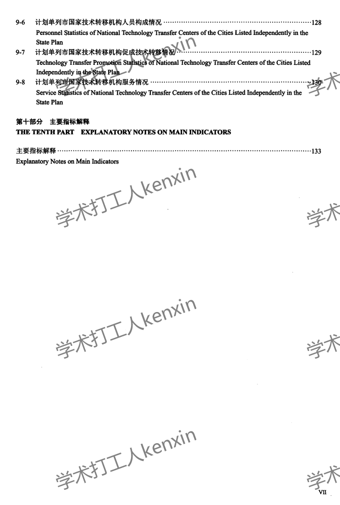
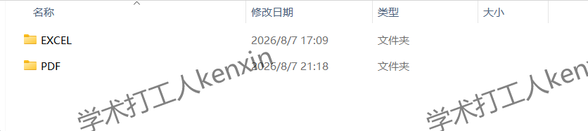

## Body

《China Torch Statistical Yearbook》（2008-2025）

Data Year: The yearbook covers data from 2008 to 2025. (The data recorded is for the previous year.)
All entries are raw yearbooks, not compiled panel data! Please be clear before purchasing and understand that after purchase, there will be no returns or exchanges.

01. Data Introduction
The China Torch Statistical Yearbook (2008-2025)

02. Indicator Details
The directory is displayed in the picture for reference. Due to the limited space of the picture, it cannot display all information. The actual content of the yearbook should be referred to for self-checking. Please make your own purchase based on discretion, as I cannot help you find data. All indicators are here, but after shipping, unreasonable returns are not supported.
The display directory is for 2025, for reference only. Different statistical口径 may change over different years. For academic knowledge, please note.

03. Data Format
Format: Both EXCEL and PDF are available. If you have any objections, do not purchase. Please read carefully before purchasing.

## Images

Here is a pay link on Stripe ( https://buy.stripe.com/3cs8yP7sY87d0vu9AB ). Please contact me lonlonago@foxmail.com after funding $89, and I will send you a complete data files , thank you!

